# Hands-on L11: AWS Core Services (S3, Glue, CloudWatch, Athena)

## Amazon S3

Amazon S3 (Simple Storage Service) is a cloud-based storage service that allows users to store and retrieve large amounts of data securely over the internet. It is highly scalable, meaning it can handle everything from small files to massive datasets. S3 also offers features like versioning, data backup, and encryption to ensure data safety and reliability. This makes it commonly used for websites, applications, backup solutions, and data analytics.

### Steps to create an Amazon S3 bucket

- Log in to the AWS Management Console and type `S3` in the search box, click on S3.
- Click on **Create bucket**.
- Enter a unique bucket name `handson-11yamini`. The AWS Region `us-east-2 (Ohio)` and Bucket type **General purpose** were already set by default based on the account region.
- Click **Create bucket** at the bottom, and S3 bucket will be created successfully.
- Click on your created bucket and then create two folders — `raw` and `processed`.
- Inside the `raw` folder, upload the CSV file named `Amazon Sale Report.csv` taken from the Kaggle dataset below.

**Dataset used:**  
Download the zip file from [https://www.kaggle.com/datasets/thedevastator/unlock-profits-with-e-commerce-sales-data?resource=download](https://www.kaggle.com/datasets/thedevastator/unlock-profits-with-e-commerce-sales-data?resource=download)  
Extract the zip and upload `Amazon Sale Report.csv` into the `raw/` folder in S3.

Below shown are the screenshots of my S3 buckets created and the dataset stored in the raw folder:

**S3 Bucket — root view showing raw/ and processed/ folders:**  
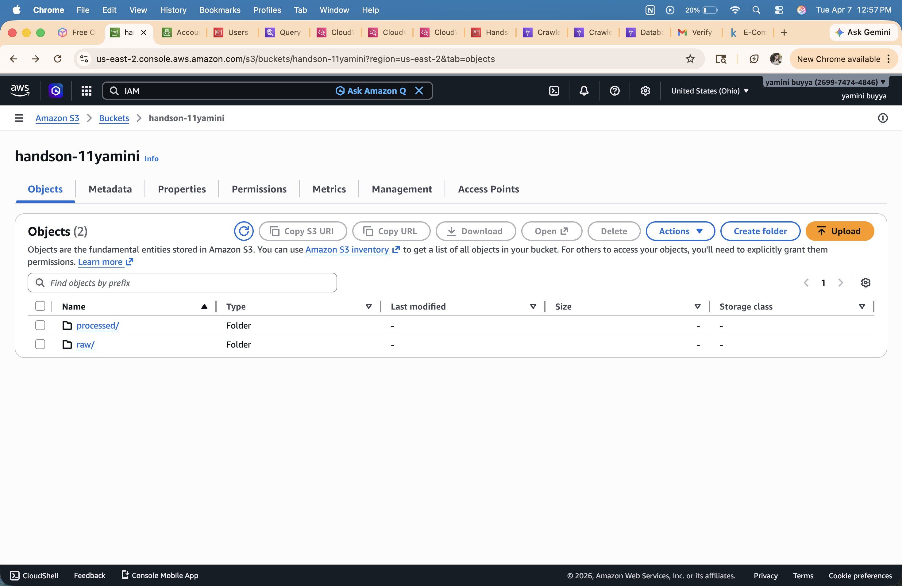

**S3 raw/ folder — Amazon Sale Report.csv (65.7 MB):**  
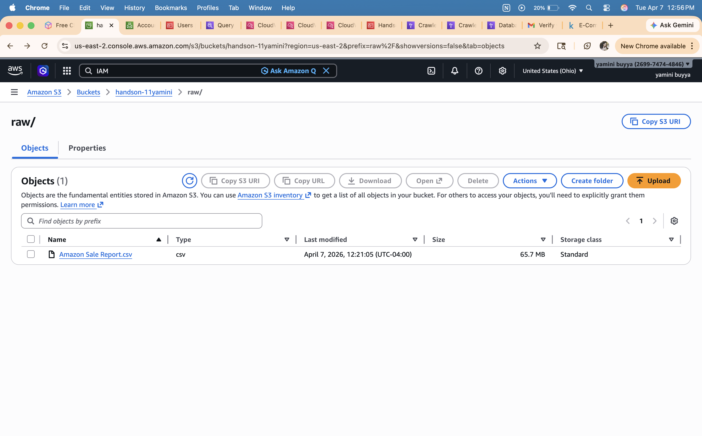

**S3 processed/ folder — for storing Athena query output:**  
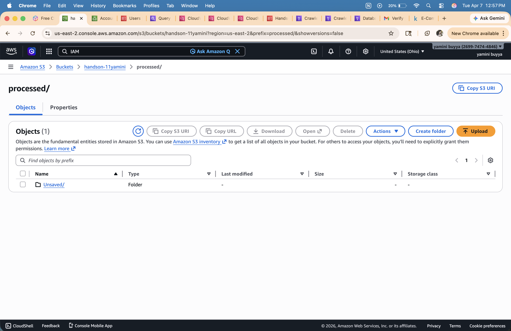

---

## IAM Role

AWS Identity and Access Management (IAM) allows you to control who can access AWS services and what actions they can perform. An IAM role is an identity with specific permissions that can be assumed by AWS services. In this hands-on, we create an IAM role so that AWS Glue has the necessary permissions to access S3 and the Glue Data Catalog on our behalf.

### Steps to create an IAM Role

- Log in to the AWS Management Console and search for `IAM`, click on IAM.
- In the left panel, click on **Roles** → click **Create role**.
- Under **Trusted entity type**, select **AWS service**. Under **Use case**, select **Glue**.
- Click **Next** and attach the following permissions policies:
  - `AmazonS3FullAccess` — allows Glue to read from and write to S3
  - `AWSGlueConsoleFullAccess` — allows full access to Glue via console
  - `AWSGlueServiceRole` — provides core Glue service permissions
- Give the role a name `Handson-11glueservicerole` and click **Create role**.

Below shown is the screenshot of the IAM role created with the attached policies:

**IAM Role — Handson-11glueservicerole:**  
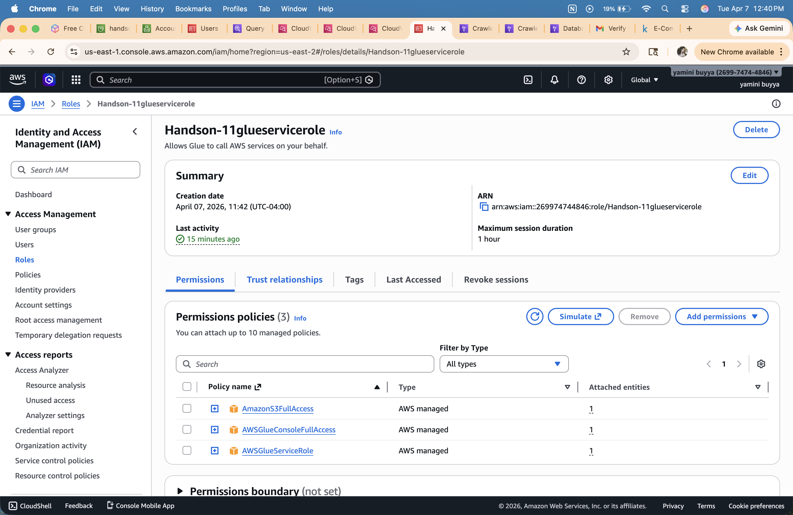

---

## AWS Glue Crawler

AWS Glue is a serverless data integration service that makes it easy to discover, prepare, and combine data for analytics. A Glue Crawler automatically scans a data source — in this case our S3 bucket — infers the schema of the file, and registers the table in the AWS Glue Data Catalog, making it instantly queryable in Athena without any manual table creation.

### Steps to create and run the Glue Crawler

- Go to the AWS Management Console and search for `AWS Glue`, click on Glue.
- In the left panel, under **Data Catalog**, click on **Crawlers** → click **Create crawler**.
- Give the crawler a name: `handson-11yaminicrawler`.
- Under **Data sources**, click **Add a data source** → select **S3** → browse and select the path `s3://handson-11yamini/raw/`.
- Under **IAM role**, select the role we created: `Handson-11glueservicerole`.
- Under **Output configuration**, select the target database `output_db`.
- Review and click **Create crawler**.
- Once created, select the crawler and click **Run** to start crawling.

The crawler scanned the CSV file in the `raw/` folder, automatically inferred all 23 column names and data types, and registered the table `raw` in the `output_db` database — ready to be queried in Athena.
**Glue Crawler — handson-11yaminicrawler properties and run history:**  
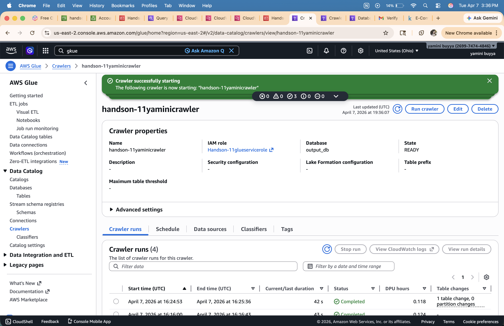

**Glue Crawler — Data source showing S3 path s3://handson-11yamini/raw/:**  


---

## CloudWatch

Amazon CloudWatch is a monitoring and observability service that collects logs and metrics from AWS services in real time. After running the Glue Crawler, we open CloudWatch Logs to verify whether the crawler ran successfully and completed all its steps without errors.

### Steps to view Crawler logs in CloudWatch

- Go to the AWS Management Console and search for `CloudWatch`, click on CloudWatch.
- In the left panel, click on **Logs** → **Log Management**.
- Under log groups, find and click on `/aws-glue/crawlers`.
- Click on the log stream for `handson-11yaminicrawler` to view the detailed run events.

### Key log events confirmed

| Log Event                                                                   | What it means                                 |
| --------------------------------------------------------------------------- | --------------------------------------------- |
| `BENCHMARK: Running Start Crawl for Crawler handson-11yaminicrawler`        | Crawler started successfully                  |
| `BENCHMARK: Classification complete, writing results to database output_db` | CSV schema was inferred and classified        |
| `INFO: Created table amazon_sale_report_csv in database output_db`          | Table was registered in the Glue Data Catalog |
| `BENCHMARK: Finished writing to Catalog`                                    | Schema written to catalog successfully        |
| `BENCHMARK: Crawler has finished running and is in state READY`             | Crawler completed with no errors              |
| `INFO: ADD: 1`                                                              | 1 new table was added to the catalog          |

Below shown is the screenshot of the CloudWatch logs confirming the crawler ran successfully:

**CloudWatch Logs — Crawler run log events:**  
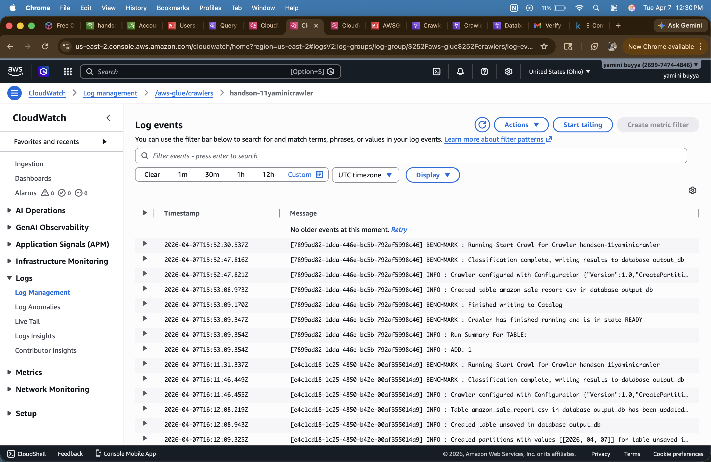

---

## Athena Queries & Results

Amazon Athena is a serverless, interactive query service that lets you analyze data stored in Amazon S3 using standard SQL — no ETL, no servers, no loading data into a separate database. Athena uses the schema registered by the Glue Crawler in the Glue Data Catalog to understand the structure of the CSV and run queries against it directly in S3.

### Steps to run queries in Athena

- Go to the AWS Management Console and search for `Athena`, click on Athena.
- Click on **Query editor**.
- On the left panel, set **Data source** to `AwsDataCatalog` and **Database** to `output_db`.
- You will see the `raw` table listed under **Tables**.
- Under **Query settings**, set the query result location to `s3://handson-11yamini/processed/`.
- Type your SQL query in the editor and click **Run**.

All 5 queries below were run against `output_db.raw`. `LIMIT 10` applied to all queries as required.

---

### Query 1 — Basic Table Exploration

**Goal:** Retrieve the first 10 records to verify the data loaded correctly and inspect the column structure.

```sql
SELECT *
FROM raw
LIMIT 10;
```

**SQL Editor:**  
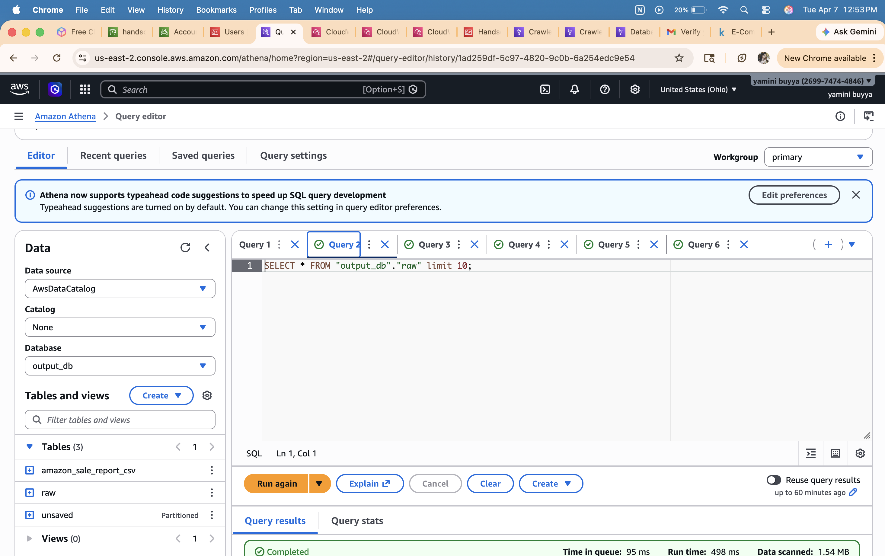

**Result:**  
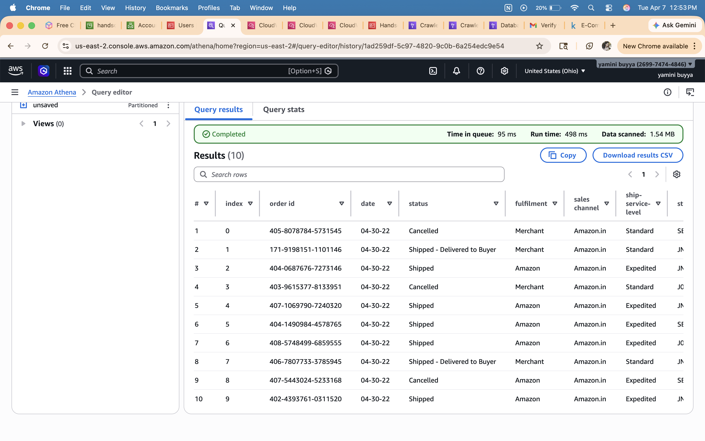

**Explanation:** This confirms the table is accessible and all columns are present. The results show order details including `order_id`, `date`, `status`, `fulfilment`, `category`, `sku`, `qty`, and `amount`. The `date` column is stored as a string in `MM-DD-YY` format.

---

### Query 2 — Orders by Product Category

**Goal:** Count the total number of orders per product category to identify which clothing categories are most popular.

```sql
SELECT
    category,
    COUNT(*) AS total_orders
FROM raw
GROUP BY category
ORDER BY total_orders DESC
LIMIT 10;
```

**SQL Editor:**  
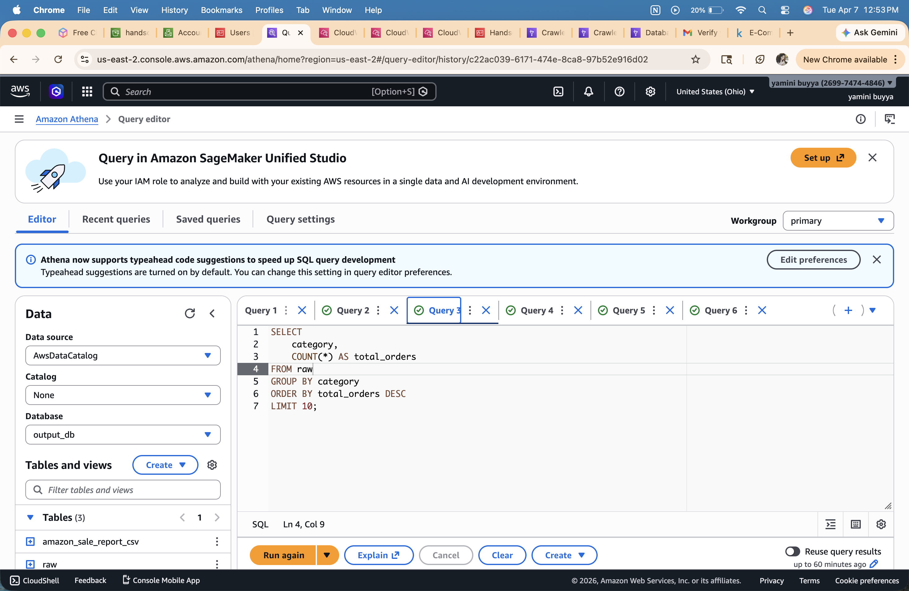

**Result:**  
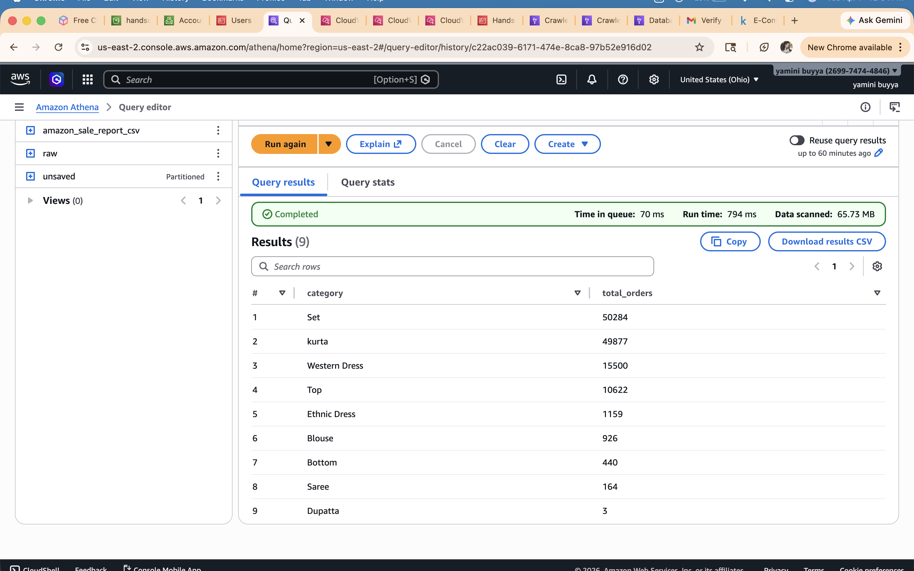

**Explanation:** `GROUP BY category` groups all rows by product type and `COUNT(*)` counts the number of orders in each group. Results show all 9 categories — `Set` leads with 50,284 orders followed by `Kurta` (49,877). Together they account for ~78% of all orders. `Dupatta` has only 3 orders — the least ordered category.

---

### Query 3 — Revenue and Quantity by Fulfilment Method

**Goal:** Compare Amazon-fulfilled vs. Merchant-fulfilled orders by order volume, units sold, and total revenue — excluding cancelled and pending orders.

```sql
SELECT
    fulfilment,
    COUNT(*) AS total_orders,
    SUM(qty) AS total_units_sold,
    ROUND(SUM(amount), 2) AS total_revenue
FROM raw
WHERE status NOT IN ('Cancelled', 'Pending', 'Pending - Waiting for Pick Up')
GROUP BY fulfilment
ORDER BY total_revenue DESC
LIMIT 10;
```

**SQL Editor:**  
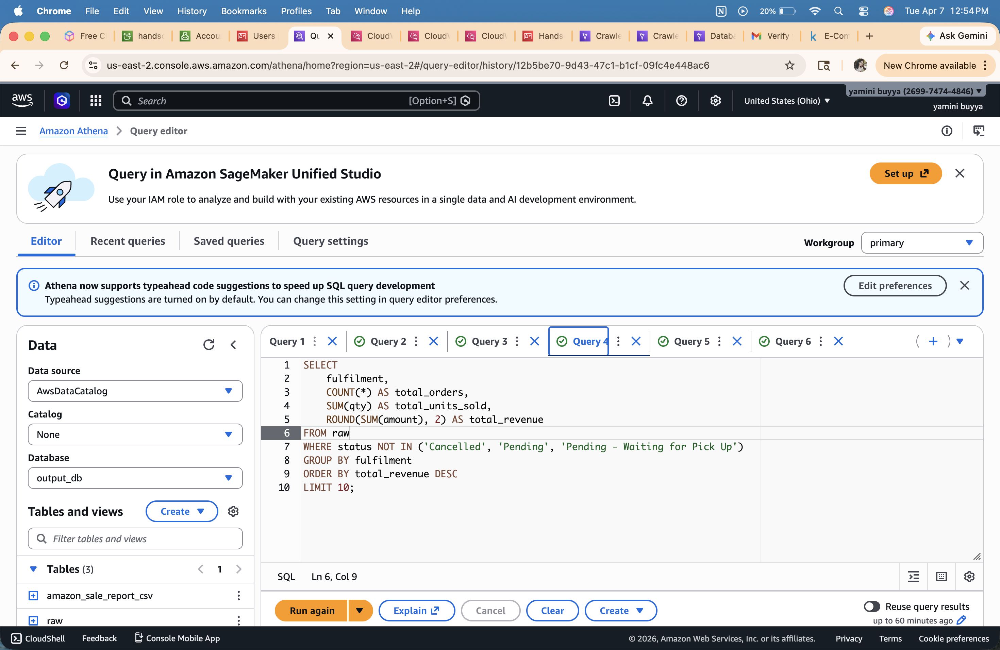

**Result:**  
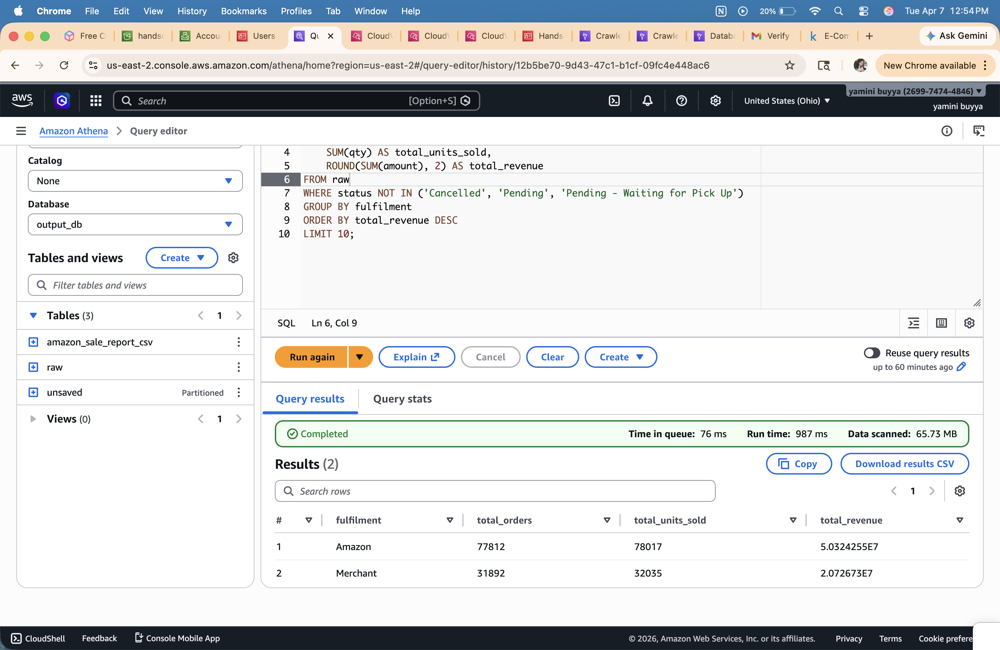

**Explanation:** The `WHERE` clause filters out all cancelled and pending orders before aggregation so revenue reflects only active and completed orders. Amazon fulfils 77,812 orders generating ~5.03 Crore INR vs Merchant's 31,892 orders at ~2.07 Crore INR — Amazon generates 2.4x more revenue.

---

### Query 4 — Monthly Sales Trend

**Goal:** Show daily order counts and revenue sorted chronologically, excluding cancelled and pending orders.

```sql
SELECT
    SUBSTR(date, 1, 5) AS month,
    COUNT(*) AS total_orders,
    ROUND(SUM(amount), 2) AS total_revenue
FROM raw
WHERE status NOT IN ('Cancelled', 'Pending', 'Pending - Waiting for Pick Up')
GROUP BY SUBSTR(date, 1, 5)
ORDER BY month ASC
LIMIT 10;
```

**SQL Editor:**  
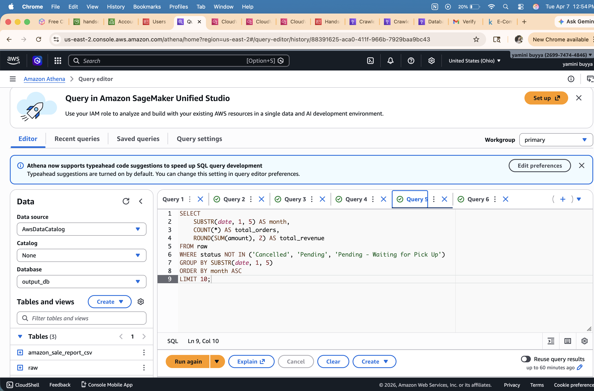

**Result:**  
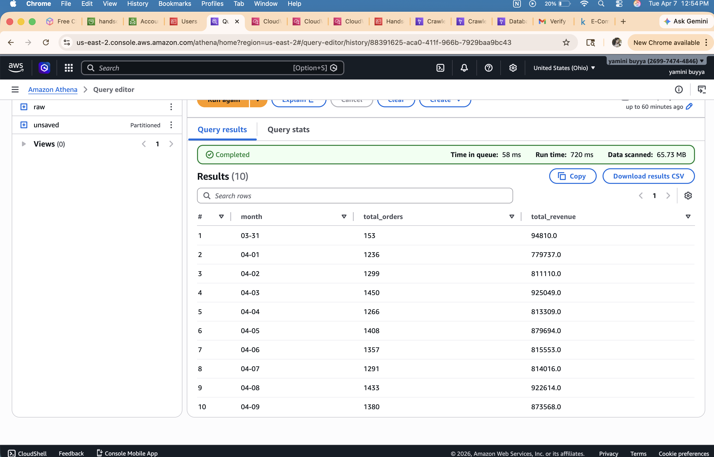

**Explanation:** Since `date` is stored as a string in `MM-DD-YY` format, `SUBSTR(date, 1, 5)` extracts just `MM-DD` (e.g., `04-01`). Grouping and ordering by this gives a chronological daily trend. Results show ~1,200–1,450 orders per day with ~800K–925K INR revenue per day in early April 2022.

---

### Query 5 — Top 5 Best-Selling SKUs per Category

**Goal:** Rank the top 5 highest-revenue SKUs within each product category using a window function — excluding cancelled, pending, and zero-quantity orders.

```sql
SELECT *
FROM (
    SELECT
        category,
        sku,
        ROUND(SUM(amount), 2) AS total_revenue,
        SUM(qty) AS total_units_sold,
        RANK() OVER (
            PARTITION BY category
            ORDER BY SUM(amount) DESC
        ) AS rnk
    FROM raw
    WHERE status NOT IN ('Cancelled', 'Pending', 'Pending - Waiting for Pick Up')
      AND qty > 0
    GROUP BY category, sku
) ranked
WHERE rnk <= 5
ORDER BY category, rnk
LIMIT 10;
```

**SQL Editor:**  
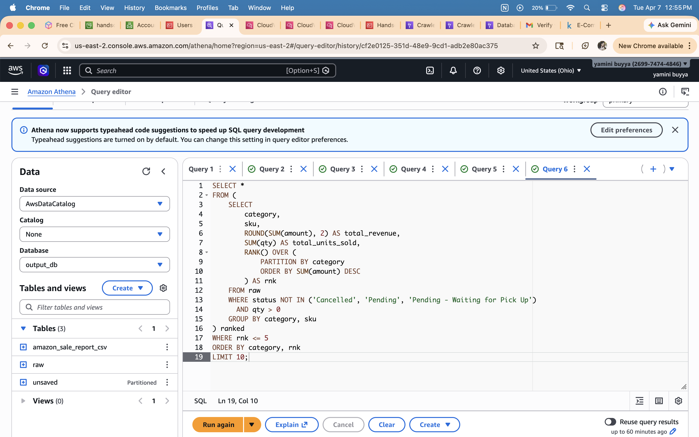

**Result:**  
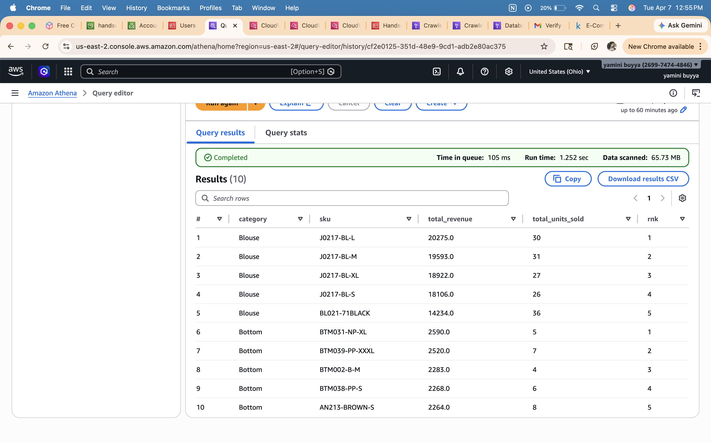

**Explanation:** The inner subquery aggregates revenue and units per `(category, sku)` pair and applies `RANK() OVER (PARTITION BY category ORDER BY SUM(amount) DESC)` — this assigns a rank within each category independently, resetting to 1 for every new category. The outer query filters `WHERE rnk <= 5` to keep only the top 5 per category. Top Blouse SKU is `J0217-BL-L` with INR 20,275 revenue across 30 units sold.

---

## Challenges Faced

### 1. S3 Path Issue — Query Returned 0 Rows

When running Query 1 for the first time, the query returned 0 rows even though the CSV file was uploaded to S3.
The issue was that while setting up the Glue Crawler, the S3 path was pointed directly to the file:
`s3://handson-11yamini/raw/Amazon Sale Report.csv`
instead of pointing to the folder.
**Fix:** Updated the S3 data source path in the Glue Crawler to point to the folder level:
`s3://handson-11yamini/raw/`
Re-ran the crawler and the table was correctly populated. Query 1 then returned all 10 rows successfully.
